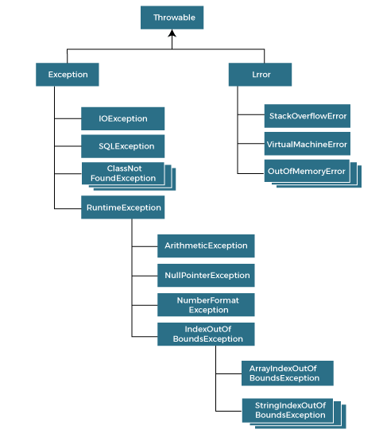

# Exceptions

The Exception is an event where the program flow disrupted because of
code mistake or user input mistake.

# Exception Handling

The Exception Handling in Java is one of the powerful mechanism
to handle the runtime errors so that the normal flow of the
application can be maintained.

# Exception classification

Exceptions are of two types:

* User-Defined Exceptions:- These exceptions are custom user
  defined exceptions. Which is created for specific purpose.
* Built-in Exceptions:- These are already predefined exceptions.
  These are also classified into two versions.

1. Checked Exceptions:- Checked Exceptions are those which are handled at complied time.
   Like:- ClassNotFoundException, IOException, etc.
2. Uncheck Exceptions:- Uncheck Exceptions are those which are handled at runtime.
   Like:- Arithmetic, ArrayIndexOutOfBounds, NullPointer, etc.

# Hierarchy of Exceptions Classes



# Way to handle Exception

```
    try {
        // code which can be expected to throw error.
    }
    catch (exception variable){
        // code to execute when exception is caught.
    }
```

# Finally block

Java finally block is a block used to execute important code such as
closing the connection, etc.
Java finally block is always executed whether an exception is handled or not.
Therefore, it contains all the necessary statements that need to be printed
regardless of the exception occurs or not.
There can be no multiple finally blocks with a try-catch block.

Note: Few conditions where finally block will not execute.

1. System.exit() Call
2. JVM Crash
3. Infinite Loop or Uninterruptible Block in try/catch

# Throws Keyword

The Java throws keyword is used to declare an exception.
It gives an information to the programmer that there may occur an exception.
So, it is better for the programmer to provide the exception handling code
so that the normal flow of the program can be maintained.

```
static void getNumber(int[] arr, int pos) throws ArrayIndexOutOfBoundsException{
        System.out.println("Element is: "+arr[pos]);
    }

```

# Throw Keyword

The throw keyword can be used to throw single exception explicitly.
```
try {
    int num = 5;
    int deno = sc.nextInt();
    if (deno == 0) {
        throw new ArithmeticException("The deno var is zero");
    }

    System.out.println("Result is: "+num/deno);
}
catch (ArithmeticException e){
    System.out.println("Exception occurred: "+ e.getMessage());
}
finally {
    System.out.println("Finally executed");
}
```
